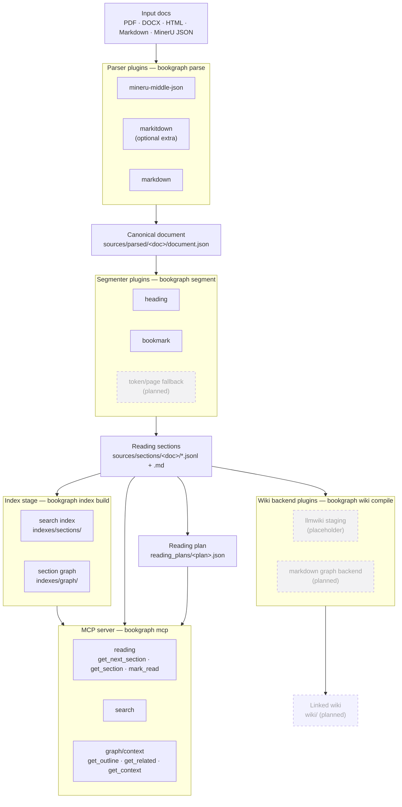

# BookGraph

BookGraph is a source-grounded book/document graph-wiki pipeline. It ingests documents,
parses them into canonical blocks, segments long sources into human reading units, compiles
those sections into a linked wiki backend, and exposes reading/query context through MCP.

The project is intentionally pluggable: parsers, segmenters, wiki backends, indexes, and MCP
servers are replaceable components behind small ports.

## Architecture

The pipeline is a chain of pluggable stages behind small ports. Each stage writes
a canonical artifact the next stage reads, and the MCP server serves reading and
graph/context tools straight off the segmented sections plus the indexes.



Dashed nodes are planned/placeholder; everything else is implemented. File type
routing picks the parser adapter, and `--parser` overrides it.

## Module layout

```text
src/bookgraph/
  cli/                      # Typer CLI (one module per pipeline stage)
  books.py                  # CLI-only book registration contract
  workspace.py              # Workspace/output path contract
  models.py                 # CanonicalBlock, Document, Section, ReadingPlan
  ports.py                  # Parser / Segmenter / WikiBackend interfaces
  plugins.py                # Name-based plugin registry
  defaults.py               # Built-in plugin registrations
  documents.py              # document.json reader/writer
  sections.py               # sections.jsonl + <section_id>.md reader/writer
  pdf_metadata.py           # cheap PDF metadata/bookmark inspection
  reading_plans.py          # reading plan store (create/next/mark-read core)
  indexes.py                # inverted search index (build/read/write core)
  graph.py                  # section graph: hierarchy + sequence edges
  parsers/
    mineru.py               # MinerU *_middle.json adapter
    markdown.py             # Markdown -> canonical blocks (shared by Markdown-producing parsers)
    markitdown.py           # MarkItDown adapter (lazy optional dependency)
    routing.py              # File type -> parser plugin name
  segmenters/
    heading.py              # Heading/title-block segmenter
    bookmark.py             # PDF bookmark/outline segmenter (heading fallback)
  wiki_backends/
    llmwiki.py              # Stage section markdown for llm-wiki-compiler
  mcp/
    service.py              # Reading/query logic (FastMCP-free, unit-tested)
    server.py               # FastMCP server wrapper (optional `mcp` extra)
```

## CLI contracts

CLI behavior and filesystem artifact contracts live in `.docs/cli/`. Update those contracts on
`main` before implementing or changing CLI behavior so other agents can coordinate safely.

## Workspace layout

Create a workspace/output directory:

```bash
bookgraph init /path/to/workspace
# or
bookgraph init --output /path/to/workspace
```

Inspect the canonical output paths:

```bash
bookgraph paths /path/to/workspace
```

Register a PDF book without running the parser/segmenter pipeline yet:

```bash
bookgraph add-book /path/to/workspace /path/to/book.pdf
# preview only
bookgraph add-book /path/to/workspace /path/to/book.pdf --dry-run
```

`add-book` only defines the contract for now. It copies the original PDF to
`sources/inbox/<book_id>/original.pdf` and writes `sources/inbox/<book_id>/book.json`
with placeholder `parser`, `segmenter`, and `wiki_backend` fields set to `null`.

Parse a source document into canonical blocks:

```bash
bookgraph parsers                                    # list parser plugins
bookgraph parse notes.md -o /path/to/workspace       # parser picked by file type
bookgraph parse book_middle.json -o /path/to/workspace
bookgraph parse report.docx -o /path/to/workspace    # needs: uv sync --extra parsers
bookgraph parse odd.bin -o /path/to/workspace --parser markdown
```

Output lands in `sources/parsed/<doc_id>/document.json`. `<doc_id>` comes from the
neighbouring `book.json` when the source sits in a registered book directory, from
`--doc-id`, or from the filename. PDFs need an explicit parser choice: parse MinerU's
`*_middle.json` for complex books, or pass `--parser markitdown` for simple text PDFs.

It creates:

```text
sources/inbox/       # original incoming files and per-book registration manifests
sources/parsed/      # parser outputs: .md, middle.json, layout.pdf, assets
sources/sections/    # section markdown generated by segmenters
wiki/                # compiled linked markdown wiki
indexes/             # graph/search indexes
reading_plans/       # daily reading progression state
runs/                # run logs/artifacts
bookgraph.toml       # workspace config
```

`bookgraph.toml` supplies workspace defaults for parser routing, MinerU runner
settings, segmenter selection/heading target level, wiki backend, and reading
plan daily batch size. Explicit CLI flags still win over config defaults.

## Development

```bash
uv run --extra dev pytest -q
uv run --extra dev ruff check .
```

## Current MVP status

Implemented:

- Pluggable `PluginRegistry`
- Parser/segmenter/wiki backend ports
- MinerU `*_middle.json` parser adapter skeleton
- Heading-based segmenter
- llmwiki staging backend
- CLI workspace initializer with explicit `--output` alias and `paths` inspector
- CLI-only `add-book` contract that registers a PDF source without running parser/segmenter
- Markdown and MarkItDown parser adapters plus file type based parser routing
- CLI `parse` / `parsers` commands writing `sources/parsed/<doc_id>/document.json`
- MinerU runner that invokes MinerU on a raw PDF and stages its `*_middle.json`
- PDF metadata/bookmark detector used during book registration
- Section writer core (`write_sections`): `sections.jsonl` + `<section_id>.md`
  reading units from segmenter output, plus a `document.json` reader
- CLI `segment` command: parses `document.json` through a segmenter and writes
  the section artifacts under `sources/sections/<doc_id>/`
- `bookgraph.toml` config loading for parser/MinerU/segmenter/wiki/reading-plan
  defaults
- Reading-plan store (`bookgraph.reading_plans`) and CLI `reading-plan
  create`/`next`/`mark-read`: daily reading progression state under
  `reading_plans/<plan_id>.json`
- TOC/bookmark-aware segmenter (`--segmenter bookmark`) fed by registered PDF
  bookmarks with heading fallback
- FastMCP server (`bookgraph mcp`, optional `mcp` extra) exposing reading tools
  (`get_next_section`, `get_section`, `mark_read`), `search`, and graph/context
  tools (`get_outline`, `get_related`, `get_context`) over the sections,
  reading-plan, and index artifacts
- Inverted search index (`bookgraph index build`) under
  `indexes/sections/<doc_id>.json` backing MCP `search`, with a live-scan
  fallback for unindexed documents
- Section graph (`bookgraph index build`) under `indexes/graph/<doc_id>.json`
  capturing heading hierarchy + reading sequence, backing the graph/context MCP
  tools, with an on-the-fly rebuild from sections when unindexed

Planned next:

- Cross-document / semantic edges in the section graph (beyond hierarchy +
  sequence) to widen graph/context results
