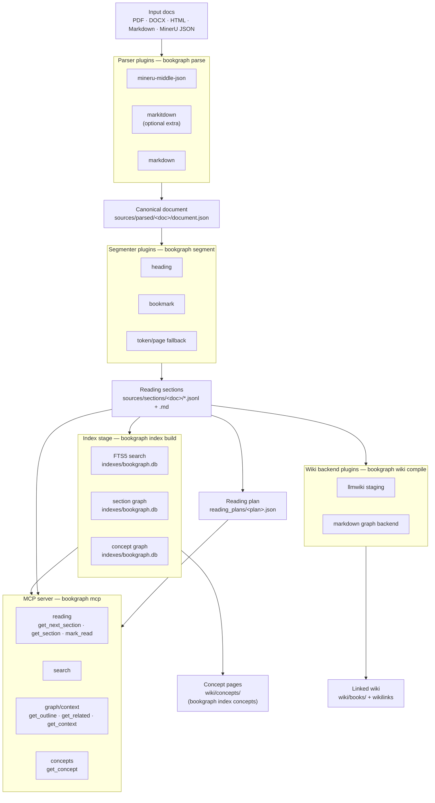

# BookGraph

BookGraph is a source-grounded **book-to-graph pipeline for AI reading**.

The goal is simple: take long books and documents, parse them into a durable
knowledge graph, and let an AI agent read that graph one section at a time. The
agent can keep its place, follow the book's outline, jump to related sections,
and connect recurring concepts across many books without losing source
provenance.

A BookGraph workspace is the source of truth. It stores inspectable artifacts for
every stage: parsed blocks, human-sized sections, linked wiki pages,
search/graph indexes, cross-book concept backlinks, and resumable reading plans
served over MCP.

BookGraph is **not just another RAG chunker**. It is built for studying and
navigating long-form sources, where provenance, reading order, outlines, and
cross-book concepts matter as much as keyword retrieval.

What makes it different from a typical RAG pipeline:

- **Artifact-first, not prompt-first** — every stage writes canonical files under
  the workspace (`document.json`, `sections.jsonl`, `indexes/bookgraph.db`,
  `reading_plans/*.json`, `wiki/`). The system is debuggable without rerunning an
  LLM call.
- **Human reading units, not arbitrary chunks** — segmentation prefers headings,
  PDF bookmarks/TOCs, page boundaries, and only then token fallback. Sections are
  meant to be read, discussed, and resumed.
- **Source-grounded by construction** — downstream notes, wiki pages, MCP answers,
  and reading plans preserve section/block provenance back to parser outputs.
- **Graph + reading plan, not only vector search** — BookGraph keeps outline
  structure, prev/next reading order, related sections, and cross-book concept
  backlinks alongside search.
- **Wiki and MCP are parallel projections** — the wiki is the human/external-LLM
  rendering; MCP serves agents from the canonical sections and indexes. Neither
  is the hidden source of truth.
- **Pluggable ports** — parsers, segmenters, wiki backends, index backends, and
  MCP serving are replaceable behind small interfaces, so heavy tools like
  MinerU, MarkItDown, llm-wiki-compiler, and FastMCP stay optional adapters.

## External tools used

BookGraph keeps heavyweight integrations optional and wraps them behind local
ports/adapters:

- [MinerU](https://github.com/opendatalab/MinerU) — raw PDF parsing/layout
  extraction, staged as MinerU `*_middle.json` before conversion to
  `document.json`.
- [MarkItDown](https://github.com/microsoft/markitdown) — optional Office/HTML/etc.
  to Markdown conversion for the `markitdown` parser adapter.
- [llm-wiki-compiler](https://github.com/atomicstrata/llm-wiki-compiler) — optional
  wiki compiler target; BookGraph's `llmwiki` backend stages section Markdown for
  this workflow.
- [FastMCP](https://github.com/jlowin/fastmcp) — optional MCP server framework used
  by `bookgraph mcp` when the `mcp` extra is installed.

## Architecture

The pipeline is a chain of pluggable stages behind small ports. Each stage writes
a canonical artifact the next stage reads, and the MCP server serves reading and
graph/context tools straight off the segmented sections plus the indexes.



File type routing picks the parser adapter, and `--parser` overrides it.

The **wiki output** (`wiki/`) and the **MCP server** are two independent, parallel
consumers of the same upstream — the sections manifest and the index — not a chain.
MCP serves reading/query programmatically straight from `sources/sections/`,
`indexes/bookgraph.db`, and `reading_plans/`; it never reads the wiki files. The
wiki is the human / external-LLM-facing rendering (book pages via `wiki compile`,
cross-book concept pages via `index concepts`). The two stay consistent because
both derive concepts from the same shared extractor (`bookgraph.concepts`), not
because one reads the other.

## Module layout

```text
src/bookgraph/
  cli/                      # Typer CLI (one module per pipeline stage)
  books.py                  # CLI-only book registration contract
  workspace.py              # Workspace/output path contract
  models.py                 # CanonicalBlock, Document, Section, ReadingPlan
  ports.py                  # Parser / Segmenter / WikiBackend interfaces
  plugins.py                # Name-based plugin registry
  defaults.py               # Built-in plugin registrations
  documents.py              # document.json reader/writer
  sections.py               # sections.jsonl + <section_id>.md reader/writer
  pdf_metadata.py           # cheap PDF metadata/bookmark inspection
  reading_plans.py          # reading plan store (create/next/mark-read core)
  graph.py                  # section graph model + builder (hierarchy + sequence)
  concepts.py               # shared deterministic concept extractor (wiki + index)
  index/
    base.py                 # IndexBackend port + hits/concept models + tokenizer
    sqlite.py               # default backend: SQLite/FTS5 (indexes/bookgraph.db)
  parsers/
    mineru.py               # MinerU *_middle.json adapter
    markdown.py             # Markdown -> canonical blocks (shared by Markdown-producing parsers)
    markitdown.py           # MarkItDown adapter (lazy optional dependency)
    routing.py              # File type -> parser plugin name
  segmenters/
    heading.py              # Heading/title-block segmenter
    bookmark.py             # PDF bookmark/outline segmenter (heading fallback)
    token_page.py           # Token-budget/page-boundary fallback segmenter
  wiki_backends/
    llmwiki.py              # Stage section markdown for llm-wiki-compiler
    markdown_graph.py       # Linked markdown wiki: book pages + wikilinks (uses concepts.py)
  mcp/
    service.py              # Reading/query logic (FastMCP-free, unit-tested)
    server.py               # FastMCP server wrapper (optional `mcp` extra)
```

## Documentation

Public docs live in `docs/`:

- `docs/cli/` — user-facing CLI guides plus filesystem/command contracts.
- `docs/mcp/` — user-facing agent/MCP setup guides.
- `docs/design/` — maintainer-facing design notes, invariants, and runtime contracts.

Update the relevant doc on `main` before implementing or changing CLI/artifact
behavior so other agents can coordinate safely.

## Installation

BookGraph needs **Python ≥ 3.11**. The recommended toolchain is
[uv](https://docs.astral.sh/uv/); heavy integrations (MinerU, MarkItDown, FastMCP)
are optional extras you add only when needed.

```bash
git clone https://github.com/chimeyrock999/bookgraph.git
cd bookgraph
uv run bookgraph --help              # run the CLI (uv resolves deps on demand)

uv sync --extra mcp --extra mineru   # add extras: mcp server + raw-PDF parsing
```

Extras: `parsers` (Office/HTML/simple-PDF), `mineru` (raw-PDF layout parsing),
`mcp` (FastMCP server), `dev` (pytest/ruff/mypy). pip/pipx work too. Full guide,
including the MinerU model download, in [`docs/installation.md`](docs/installation.md).

## Workspace layout

Create a workspace/output directory:

```bash
bookgraph init /path/to/workspace
# or
bookgraph init --output /path/to/workspace
```

Inspect the canonical output paths:

```bash
bookgraph paths /path/to/workspace
```

Register a PDF book without running the parser/segmenter pipeline yet:

```bash
bookgraph add-book /path/to/workspace /path/to/book.pdf
# preview only
bookgraph add-book /path/to/workspace /path/to/book.pdf --dry-run
```

`add-book` only defines the contract for now. It copies the original PDF to
`sources/inbox/<book_id>/original.pdf` and writes `sources/inbox/<book_id>/book.json`
with placeholder `parser`, `segmenter`, and `wiki_backend` fields set to `null`.

Parse a source document into canonical blocks, or parse a registered raw PDF book
through the MinerU runner in one command:

```bash
bookgraph parsers                                    # list parser plugins
bookgraph parse notes.md -o /path/to/workspace       # parser picked by file type
bookgraph parse book_middle.json -o /path/to/workspace
bookgraph parse report.docx -o /path/to/workspace    # needs: uv sync --extra parsers
bookgraph parse odd.bin -o /path/to/workspace --parser markdown
bookgraph parse-book /path/to/workspace <book_id> --backend pipeline  # needs: uv sync --extra mineru
# Large raw PDFs print a runs/parse-book/*.log path; see docs/cli/parse-book-large-pdfs.md
```

Output lands in `sources/parsed/<doc_id>/document.json`. `<doc_id>` comes from the
neighbouring `book.json` when the source sits in a registered book directory, from
`--doc-id`, or from the filename. For raw registered PDFs, `bookgraph parse-book`
invokes MinerU, stages the generated middle JSON under `sources/parsed/<book_id>/`,
then writes `document.json` via the `mineru-middle-json` parser. Direct `bookgraph
parse` on a raw PDF still needs an explicit parser choice, such as `--parser
markitdown` for simple text PDFs.

It creates:

```text
sources/inbox/       # original incoming files and per-book registration manifests
sources/parsed/      # parser outputs: .md, middle.json, layout.pdf, assets
sources/sections/    # section markdown generated by segmenters
wiki/                # compiled linked markdown wiki
indexes/             # graph/search indexes
reading_plans/       # daily reading progression state
runs/                # run logs/artifacts
bookgraph.toml       # workspace config
```

`bookgraph.toml` supplies workspace defaults for parser routing, MinerU runner
settings, segmenter selection/heading target level, wiki backend, and reading
plan daily batch size. Explicit CLI flags still win over config defaults.

## Development

```bash
uv run --extra dev pytest -q
uv run --extra dev ruff check .
uv run --extra dev mypy src/bookgraph
```

Build release distributions locally:

```bash
uv build
uvx twine check dist/*
```

GitHub Actions builds release artifacts with `.github/workflows/release.yml`:

- `workflow_dispatch` builds and uploads the `bookgraph-dist` artifact.
- pushing a `v*` tag builds the same artifacts and attaches them to a GitHub
  Release with generated release notes.

## Agent skills

BookGraph ships a `bookgraph-reader` skill in two forms:

- `.claude/skills/bookgraph-reader/SKILL.md` for Claude agents.
- `.agents/skills/bookgraph-reader/SKILL.md` as an agent-neutral procedure for
  Hermes/custom MCP clients or any agent runtime that can load `SKILL.md`.

Both describe the MCP reading loop over a prepared workspace.

## Current MVP status

Implemented:

- Pluggable `PluginRegistry`
- Parser/segmenter/wiki backend ports
- MinerU `*_middle.json` parser adapter skeleton
- Heading-based segmenter with deterministic duplicate-slug suffixes
- llmwiki staging backend and real `bookgraph wiki compile` command
- Markdown graph wiki backend (`--backend markdown-graph`) writing linked book
  pages under `wiki/books/<doc_id>/` with deterministic concept wikilinks in
  section pages
- CLI workspace initializer with explicit `--output` alias and `paths` inspector
- CLI-only `add-book` contract that registers a PDF source without running parser/segmenter
- Markdown and MarkItDown parser adapters plus file type based parser routing
- CLI `parse` / `parsers` commands writing `sources/parsed/<doc_id>/document.json`
- MinerU runner, exposed through `bookgraph parse-book`, that invokes MinerU on a
  registered raw PDF and stages its `*_middle.json`
- PDF metadata/bookmark detector used during book registration
- Section writer core (`write_sections`): `sections.jsonl` + `<section_id>.md`
  reading units from segmenter output, plus a `document.json` reader
- CLI `segment` command: parses `document.json` through a segmenter and writes
  the section artifacts under `sources/sections/<doc_id>/`
- `bookgraph.toml` config loading for parser/MinerU/segmenter/wiki/reading-plan
  defaults
- Reading-plan store (`bookgraph.reading_plans`) and CLI `reading-plan
  create`/`next`/`mark-read`: daily reading progression state under
  `reading_plans/<plan_id>.json`
- TOC/bookmark-aware segmenter (`--segmenter bookmark`) fed by registered PDF
  bookmarks with heading fallback
- Token/page fallback segmenter (`--segmenter token-page`) for documents without
  useful headings or bookmarks; chunks whole blocks by token budget while
  preferring page boundaries when possible
- FastMCP server (`bookgraph mcp`, optional `mcp` extra) exposing reading tools
  (`get_next_section`, `get_section`, `mark_read`), `search`, graph/context tools
  (`get_outline`, `get_related`, `get_context`), and the cross-book concept tool
  (`get_concept`) over the sections, reading-plan, and index artifacts
- SQLite index (`bookgraph index build`) in `indexes/bookgraph.db` behind a
  pluggable `IndexBackend` port (default: SQLite/FTS5): an FTS5 `bm25` search
  table backing MCP `search` (with cross-document search and a live-scan fallback
  for unindexed documents) and a section-graph table capturing heading hierarchy
  + reading sequence, backing the graph/context tools (rebuilt from sections when
  unindexed)
- Cross-book concept graph in `indexes/bookgraph.db` (`concept_mentions` table +
  `concept_nodes` view), populated per document by `index build` from a shared
  deterministic concept extractor (also used by the `markdown-graph` wiki backend),
  backing the MCP `get_concept` tool; `bookgraph index concepts` renders cross-book
  `wiki/concepts/<slug>.md` backlink pages from it

Planned next:

- Cross-document / semantic edges in the section graph (beyond hierarchy +
  sequence) to widen graph/context results
- Richer / LLM-assisted concept extraction beyond the deterministic first pass
- Alternative `IndexBackend` implementations (e.g. a vector/embedding store) via
  the same port
