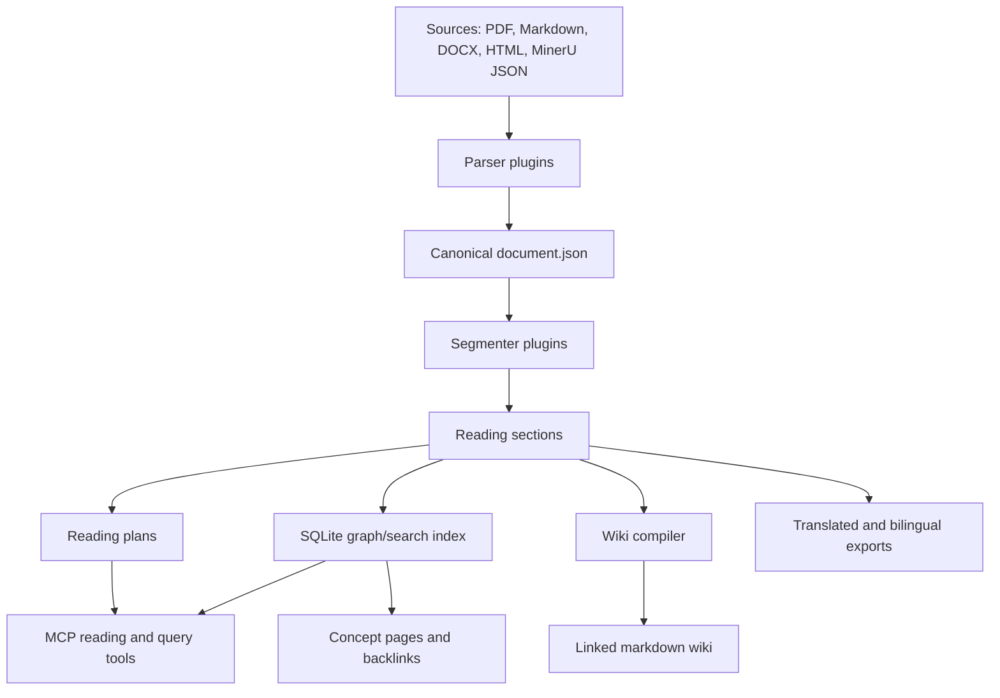

# BookGraph

> Source-grounded book and document intelligence for AI agents: parse long PDFs,
> Markdown, Office documents, and MinerU output into a durable graph of sections,
> concepts, reading plans, wiki pages, and MCP tools.


BookGraph turns long-form sources into an inspectable workspace an AI agent can read
without losing order, context, or provenance. It is built for books, manuals,
research reports, technical PDFs, and document collections where a generic RAG
chunk store is not enough.

A BookGraph workspace stores every stage as files you can inspect: source manifests,
parsed blocks, human-sized sections, graph/search indexes, linked wiki pages,
concept backlinks, translations, exports, and resumable reading plans. Agents use the
same artifacts through the optional MCP server, so answers stay grounded in source
sections rather than hidden prompts.

## What BookGraph does

- **Parses documents into canonical evidence** — Markdown, MinerU middle JSON, and
  optional MarkItDown/MinerU adapters produce `document.json` with stable block IDs,
  page spans, headings, captions, and asset references.
- **Segments by reading structure** — sections prefer headings, PDF bookmarks/TOCs,
  page boundaries, then token/page fallback. The unit is something a person or agent
  can read and discuss, not an arbitrary embedding chunk.
- **Builds a document knowledge graph** — SQLite/FTS5 indexes preserve outline order,
  prev/next links, related sections, concepts, and cross-book backlinks.
- **Serves AI reading workflows over MCP** — agents can list documents, follow reading
  plans, fetch the next section, mark progress, search, inspect outlines, retrieve
  related context, and validate reading batches.
- **Compiles a linked markdown wiki** — book pages and concept pages are generated from
  the same sections/indexes the MCP server reads.
- **Exports translated reading editions** — partially translated sections can be
  assembled into translated or bilingual PDFs/HTML, with asset checks and coverage
  reports.
- **Keeps heavy tools optional** — MinerU, MarkItDown, FastMCP, llm-wiki-compiler,
  WeasyPrint, and Playwright are adapters behind ports, not mandatory runtime
  dependencies.

## Why not just RAG?

Most retrieval pipelines flatten books into chunks and hope search reconstructs the
argument later. BookGraph keeps the structure first:

| Need | BookGraph behavior |
| --- | --- |
| Long-book reading | Stable reading plans with next/previous progress |
| Source grounding | Every section traces back to parser blocks and source pages |
| Navigation | Outlines, chapter trees, section order, related sections |
| Cross-book study | Deterministic concept extraction and concept pages |
| Agent use | MCP tools over canonical artifacts, not ad-hoc prompt state |
| Debuggability | Files and SQLite indexes on disk at every stage |

## Install

BookGraph requires **Python 3.11+**. The recommended toolchain is
[`uv`](https://docs.astral.sh/uv/), but normal `pip` installs work too.

Install the latest release wheel:

```bash
gh release download --repo chimeyrock999/bookgraph --pattern '*.whl'
python -m pip install ./bookgraph-*.whl
```

Install with common extras:

```bash
WHEEL=$(ls bookgraph-*.whl)

# MCP server for AI agents
python -m pip install "${WHEEL}[mcp]"

# Raw PDF parsing with MinerU 4
python -m pip install "${WHEEL}[mineru]"

# Development from a clone
git clone https://github.com/chimeyrock999/bookgraph.git
cd bookgraph
uv run bookgraph --help
```

Optional extras:

| Extra | Enables |
| --- | --- |
| `parsers` | MarkItDown + pypdf adapters for Office/HTML/simple-PDF inputs |
| `mineru` | MinerU 4 raw-PDF parsing via `bookgraph parse-book` |
| `mineru-torch` | MinerU Torch stack for GPU-backed model setups |
| `mcp` | FastMCP server exposed by `bookgraph mcp` |
| `pdf` | WeasyPrint renderer for translated PDF export |
| `pdf-chromium` | Playwright/Chromium renderer for translated PDF export |
| `dev` | pytest, ruff, mypy, and contributor tooling |

Full install notes: [`docs/installation.md`](docs/installation.md).

## Quickstart

Create a workspace:

```bash
bookgraph init /path/to/workspace
bookgraph paths /path/to/workspace
```

Register a raw PDF book (copies it to `sources/inbox/<book_id>/` and writes a
`book.json` registration manifest; add `--dry-run` to preview). An EPUB or DOCX can be
registered too, to parse it with MinerU explicitly; `bookgraph parse` reads it with
MarkItDown without registration:

```bash
bookgraph add-book /path/to/workspace /path/to/book.pdf
```

Parse a source into canonical blocks:

```bash
bookgraph parsers
bookgraph parse notes.md -o /path/to/workspace
bookgraph parse report.docx -o /path/to/workspace        # needs the parsers extra
bookgraph parse book_middle.json -o /path/to/workspace   # MinerU middle JSON
bookgraph parse odd.bin -o /path/to/workspace --parser markdown
```

Parse a registered raw PDF with MinerU 4:

```bash
bookgraph parse-book /path/to/workspace <book_id> --tier basic
```

Segment the parsed document into reading sections:

```bash
bookgraph segment /path/to/workspace <doc_id> --segmenter heading
bookgraph segment /path/to/workspace <doc_id> --segmenter bookmark
bookgraph segment /path/to/workspace <doc_id> --segmenter token-page --max-tokens 800
```

Build indexes and wiki output:

```bash
bookgraph index build /path/to/workspace <doc_id>
bookgraph index concepts /path/to/workspace
bookgraph wiki compile /path/to/workspace <doc_id>
```

Create and use a reading plan:

```bash
bookgraph reading-plan create /path/to/workspace <doc_id> --plan-id main
bookgraph mcp /path/to/workspace                         # needs the mcp extra
```

Export translated reading editions when translations exist:

```bash
bookgraph export translated-pdf /path/to/workspace <doc_id> --lang vi
bookgraph export translated-pdf /path/to/workspace <doc_id> --lang vi --mode bilingual
bookgraph export translated-pdf /path/to/workspace <doc_id> --lang vi --out exports/book.vi.epub
bookgraph export translated-pdf /path/to/workspace <doc_id> --lang vi --check
bookgraph assets repair /path/to/workspace <doc_id> --dry-run
```

## Workspace layout

A workspace is the durable source of truth:

```text
sources/inbox/       # original incoming files and per-book book.json manifests
sources/parsed/      # parser outputs: document.json, staged markdown, MinerU artifacts
sources/sections/    # section manifests and section markdown files
wiki/                # compiled linked markdown wiki
indexes/             # SQLite graph/search/concept indexes
annotations/         # agent/user reading annotations
reading_plans/       # resumable reading progress
runs/                # long-running parse logs and artifacts
translations/        # optional per-language section translations
exports/             # reader-facing exports such as translated PDFs and EPUBs
bookgraph.toml       # workspace configuration
```

`bookgraph.toml` can set parser routing, MinerU runner settings, segmenter defaults,
wiki backend, and reading-plan batch size. Explicit CLI flags override config.

## MCP tools for reading agents

Install the MCP extra and point your MCP client at a workspace:

```bash
uv run --extra mcp bookgraph mcp /path/to/workspace
```

The server exposes reading and graph tools including:

- `list_documents`, `list_plans`
- `get_next_section`, `get_section`, `mark_read`
- `validate_reading_batch`, `complete_reading_batch`
- `search`, `get_outline`, `get_section_tree`, `get_chapter_outline`
- `get_related`, `get_context`, `get_concept`
- translation and asset-aware section helpers

Guide: [`docs/mcp/reading-agent.md`](docs/mcp/reading-agent.md).

BookGraph also ships a `bookgraph-reader` skill for agents that can load skill files:

- `.claude/skills/bookgraph-reader/SKILL.md`
- `.agents/skills/bookgraph-reader/SKILL.md`

## Architecture

BookGraph is a pipeline of small ports and adapters. Each stage writes an artifact the
next stage reads; no stage has to trust hidden in-memory state.


```mermaid
flowchart TD
    A[Sources: PDF, Markdown, DOCX, HTML, MinerU JSON] --> B[Parser plugins]
    B --> C[Canonical document.json]
    C --> D[Segmenter plugins]
    D --> E[Reading sections]
    E --> F[SQLite graph/search index]
    E --> G[Reading plans]
    E --> H[Wiki compiler]
    F --> I[MCP reading and query tools]
    G --> I
    H --> J[Linked markdown wiki]
    F --> K[Concept pages and backlinks]
    E --> L[Translated and bilingual exports]
```

Core modules:

```text
src/bookgraph/
  cli/                      # Typer CLI (one module per pipeline stage)
  books.py                  # CLI-only book registration contract
  workspace.py              # Workspace/output path contract
  models.py                 # CanonicalBlock, Document, Section, ReadingPlan
  ports.py                  # Parser / Segmenter / WikiBackend interfaces
  plugins.py                # Name-based plugin registry
  defaults.py               # Built-in plugin registrations
  documents.py              # document.json reader/writer
  sections.py               # sections.jsonl + <section_id>.md reader/writer
  pdf_metadata.py           # cheap PDF metadata/bookmark inspection
  reading_plans.py          # reading plan store (create/next/mark-read core)
  graph.py                  # section graph model + builder (hierarchy + sequence)
  concepts.py               # shared deterministic concept extractor (wiki + index)
  quality.py                # ingest/section quality checks (segment report + MCP warnings)
  assets.py                 # one asset-reference resolver (shared by MCP + quality)
  exports/
    translated.py           # partially translated reading edition (HTML assembly + report)
    outline.py              # export structure from the PDF outline (depth, order, chapters)
    render.py               # page shell, title page, TOC, nested sections
    bilingual.py            # bilingual (original | translated) row layout and styles
    images.py               # image embedding (data: URIs) + asset warnings for exports
    html_attrs.py           # attribute-aware HTML tag scanning shared by exports
    renderers.py            # ExportWriter port: weasyprint / playwright / html / epub
    epub.py                 # EPUB 3 writer: chapter files, nav, OPF, images, file-aware links
    xhtml.py                # HTML fragment -> well-formed XHTML for EPUB
  index/
    base.py                 # IndexBackend port + hits/concept models + tokenizer
    sqlite.py               # default backend: SQLite/FTS5 (indexes/bookgraph.db)
  parsers/
    mineru.py               # MinerU *_middle.json adapter (3.x pdf_info + 4.x dispatch)
    mineru_middle_v2.py     # MinerU 4 docvortex.middle 2.x -> canonical blocks
    mineru_runner.py        # mineru-kit subprocess runner + result-bundle staging
    mineru_profiles.py      # profile -> MinerU 4 tier resolution, removed 3.x knobs
    markdown.py             # Markdown -> canonical blocks (shared by Markdown-producing parsers)
    markitdown.py           # MarkItDown adapter (lazy optional dependency)
    routing.py              # File type -> parser plugin name
  segmenters/
    heading.py              # Heading/title-block segmenter
    bookmark.py             # PDF bookmark/outline segmenter (heading fallback)
    token_page.py           # Token-budget/page-boundary fallback segmenter
    pages.py                # shared page-span clamp (no backwards/negative spans)
  wiki_backends/
    llmwiki.py              # Stage section markdown for llm-wiki-compiler
    markdown_graph.py       # Linked markdown wiki: book pages + wikilinks (uses concepts.py)
  mcp/
    service.py              # Reading/query API facade (FastMCP-free, unit-tested)
    reading_tools.py        # next section, progress, get_section, mark_read, documents, plans
    query_tools.py          # search, outlines, related sections, section context
    concept_tools.py        # get_concept, concept_hygiene, annotate_section
    translation_tools.py    # section translation registry tools
    loading.py              # shared workspace loading (sections, cached blocks, plans)
    views.py / errors.py    # tool result models / service errors
    server.py               # FastMCP server wrapper (optional `mcp` extra)
```

## External integrations

BookGraph wraps external tools instead of making them global assumptions:

- [MinerU](https://github.com/opendatalab/MinerU) for raw PDF layout/OCR parsing.
- [MarkItDown](https://github.com/microsoft/markitdown) for Office/HTML/simple-PDF
  conversion into Markdown.
- [llm-wiki-compiler](https://github.com/atomicstrata/llm-wiki-compiler) for an
  optional compiled-wiki workflow and local viewer.
- [FastMCP](https://github.com/jlowin/fastmcp) for the optional MCP server.
- WeasyPrint, Playwright/Chromium, or the built-in EPUB writer for translated exports.

## Documentation

- [`docs/installation.md`](docs/installation.md) — install BookGraph and extras.
- [`docs/cli/`](docs/cli/) — command contracts, artifacts, workspace layout.
- [`docs/cli/parse-book-large-pdfs.md`](docs/cli/parse-book-large-pdfs.md) — long
  MinerU runs, logs, model caches, and diagnosis.
- [`docs/mcp/`](docs/mcp/) — MCP client setup and agent reading workflows.
- [`docs/design/`](docs/design/) — maintainer contracts and design notes.

## Development

```bash
uv sync --extra dev
uv run --extra dev pytest -q
uv run --extra dev ruff check .
uv run --extra dev mypy src/bookgraph
```

Build release distributions locally:

```bash
uv build
uvx twine check dist/*
```

GitHub Actions builds release artifacts with `.github/workflows/release.yml`: manual
`workflow_dispatch` uploads the `bookgraph-dist` artifact, and pushing a `v*` tag
attaches distributions to a GitHub Release.


